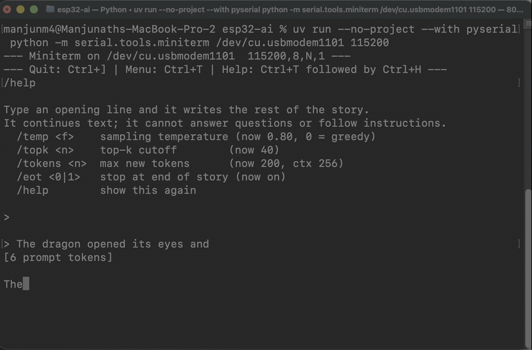

# A 28.9M-parameter language model you can talk to on an $8 microcontroller

Type an opening line into a serial terminal and an ESP32-S3 writes the rest of
the story — on the chip itself, with no network, no server, and no phone
involved. It tokenizes your text on-device and streams words back at roughly
9.5 tokens per second.

The model holds 28.9 million parameters, which does not fit in a microcontroller's
memory by any normal reading. It fits because most of the model never enters RAM:
25 million of those parameters live in flash as a lookup table, and only about
450 bytes of it are read per token. That idea is Google's Per-Layer Embeddings,
from the Gemma models, applied to the memory hierarchy of a microcontroller.



**▶ [Watch the full session on Vimeo](https://vimeo.com/1215094870)** — unedited:
a story written from a typed opening line, greedy decoding locking into a
repeated sentence, a 600-token run with the context window sliding three times,
and the per-token timings on screen throughout.

## What it does

```
> Once upon a time there was a small robot who loved to paint
[13 prompt tokens]

Once upon a time there was a small robot who loved to paint. Every day, the
robot would build towers and houses and birds. The robot loved to play outside
and play. All day long, until one day, a big storm came and moved closer...

--- 131 tokens in 13.43 s, end of story ---
throughput: 9.76 tok/s   (99.6 ms/token)
profile ms/token: input 4.4 | attn 22.1 | ffn 6.9 | ple 8.5 | head 57.6
```

Commands: `/temp <f>` (0 = greedy), `/topk <n>`, `/tokens <n>`, `/eot <0|1>`,
`/help`.

## What it is not

The model was trained only on TinyStories, so it continues text and nothing else.
It will not answer questions, follow instructions, write code, or know facts. Ask
it the capital of France and it will write you a short story about France. That
ceiling comes from the 559K-parameter dense core that does the actual reasoning,
and the flash lookup table does not move it — the table buys coherence, not
capability.

"28.9M parameters" here means parameters *resident via a memory-hierarchy split*.
It is not a capability claim, and it should not be read as one.

## Hardware

An ESP32-S3 with **16MB flash and 8MB PSRAM** (the N16R8 class, around $8). The
model partition alone needs 14.9MB, so smaller flash variants will not work.
Nothing else is required — no display, no network. Verify a board with:

```bash
esptool --port /dev/cu.usbmodem1101 flash-id
# want: ESP32-S3, "Embedded PSRAM 8MB", "Detected flash size: 16MB"
```

## Run it

Everything below assumes `uv` and `arduino-cli`. The dataset, checkpoint and
flash artifact are all in the repo via Git LFS, so a clone can flash immediately
without training anything.

```bash
git lfs install        # once per machine, BEFORE cloning
git clone https://github.com/manjunathshiva/esp32-tinyllm
cd esp32-tinyllm
git lfs pull
```

Without `git lfs install`, `git lfs pull` prints "Skipping object checkout" and
leaves ~133-byte text pointer files in place of the model — the flash then fails
in a confusing way. Check you got the real thing:

```bash
shasum -a 256 firmware/model/model.bin
# 14,912,332 bytes
# dd22df35df128fab39b9e1738af8377bb493a778942e28f1d4a621a40c542a28
```

Install the toolchain once:

```bash
arduino-cli core install esp32:esp32@3.3.10 \
  --additional-urls https://espressif.github.io/arduino-esp32/package_esp32_index.json
```

Build and flash. Substitute your own serial port:

```bash
FQBN='esp32:esp32:esp32s3:UploadSpeed=921600,USBMode=hwcdc,CDCOnBoot=cdc,UploadMode=default,CPUFreq=240,FlashMode=qio,FlashSize=16M,PartitionScheme=custom,PSRAM=opi,DebugLevel=info'

arduino-cli compile --fqbn "$FQBN" \
  --build-property compiler.optimization_flags=-O3 \
  --build-path /tmp/esp32-llm-build firmware/esp32_llm

arduino-cli upload -p /dev/cu.usbmodem1101 --fqbn "$FQBN" \
  --input-dir /tmp/esp32-llm-build firmware/esp32_llm

esptool --chip esp32s3 --port /dev/cu.usbmodem1101 --baud 921600 \
  write-flash 0x110000 firmware/model/model.bin        # 14.9MB, ~165 s
```

Then talk to it:

```bash
uv run --no-project --with pyserial python -m serial.tools.miniterm \
  /dev/cu.usbmodem1101 115200        # quit with Ctrl-]
```

**Serial port note.** `CDCOnBoot=cdc` sends output to the ESP32-S3's *native* USB
port (`/dev/cu.usbmodem*`). If your board is connected through a CH340/CP2102
UART bridge (`/dev/cu.wchusbserial*`, `/dev/cu.SLAB*`), build with
`CDCOnBoot=default` instead or you will see nothing. The bridge has one advantage
for recording: pressing RESET does not drop the connection, so you can film boot
and generation in a single take.

**Terminal note.** miniterm is recommended because it leaves local echo off — the
firmware echoes your keystrokes itself, so a terminal that also echoes locally
doubles every character. `screen` works too, but its command prefix is Ctrl-A and
mouse reporting can leak escape sequences into your input line.

The model payload only needs reflashing after a new export; firmware-only changes
just need the `upload` step.

## Rebuilding the model from scratch

Only needed if you want to retrain. Roughly 10 minutes on Apple Silicon.

```bash
uv run python data/prepare.py --vocab 32768            # ~300MB download

uv run python src/train.py --arm ple --vocab 32768 --d-model 96 --n-layers 6 \
  --ple-dim 128 --target-core 560000 --batch-size 16 --seq-len 256 \
  --steps 5000 --seed 0 --tag cleandeploy              # ~7.6 min, val ppl 11.36

(cd src && uv run python export.py)                    # -> model.bin + golden
(cd src && uv run python gen_assets.py)                # -> vocab.h + bpe.h
```

Two host gates run before anything touches hardware, and both should pass:

```bash
cc -O3 -o /tmp/verify firmware/host_verify/verify.c -lm
/tmp/verify firmware/model/model.bin firmware/model/golden.txt
# PASS: C matches PyTorch golden, max abs diff 0.00002

cc -O3 -o /tmp/tok_test firmware/host_verify/tok_test.c
uv run python src/tok_check.py
# PASS: device encoder matches the training tokenizer, 2000/2000 lines
```

## How it fits

The ESP32-S3 has 512KB of internal SRAM. Normally the whole model must be
reachable from there, which caps you at a very small model. Here the parameters
are split by *access pattern* rather than by size:

```
SRAM   (fast, tiny)   the 559K-param core, touched on every token
PSRAM  (medium)       the output head, staged as int8 at boot (2.54MB)
FLASH  (huge, slow)   the 25M-param table, ~6 rows read per token (~450 B)
```

The flash table is nearly free: measured on-chip, it accounts for well under 1%
of per-token memory time. What actually costs money is the output head, which is
scanned in full every token and is PSRAM-bandwidth-bound.

Measured on an ESP32-S3 N16R8: **103.0 ms per token (9.5 tok/s)**, split as
output head 57.6ms, attention 25.6ms, PLE path 8.5ms, FFN 6.9ms, input 4.4ms.

Context is **256 positions total**, prompt included. Past that the KV cache
slides: the oldest half is dropped and the rest shifts down. Cached keys carry
RoPE at their original absolute position, so sliding alone would leave them
claiming positions they no longer hold. Re-priming would fix that at one full
forward pass per carried token — seconds of stall. Because RoPE is a rotation by
`pos * freq` and rotations compose, re-basing a key from `p` to `p-drop` is
instead a single rotation by `-(drop * freq)`. A 600-token run does this three
times and stays coherent throughout, at 8.7 tok/s — slower only because
attention cost grows with position.

A rolling window is not a longer memory. The model does forget the opening.

## Layout

| path | what |
|---|---|
| `src/` | training, 4-bit export, quantization checks, asset generation |
| `firmware/common/llm.h` | portable inference: same code on host and device |
| `firmware/common/tokenizer.h` | on-device BPE encoder (ByteLevel + merges) |
| `firmware/esp32_llm/` | the Arduino sketch, partition table, generated tables |
| `firmware/host_verify/` | the host gates: logits golden, perplexity, tokenizer |
| `experiments/` | ablation runners |
| `RESULTS.md` | the ablations and on-chip measurements behind the design |

## Citation

This project builds on **[slvDev/esp32-ai](https://github.com/slvDev/esp32-ai)**
by Viacheslav Sierbov, which established the Per-Layer-Embeddings-on-a-
microcontroller approach, the training and ablation harness, the 4-bit export
format, and the portable C runtime. It is MIT licensed, and that license and its
copyright notice are retained in [`LICENSE`](LICENSE).

```bibtex
@software{sierbov_esp32_ai,
  author = {Sierbov, Viacheslav},
  title  = {esp32-ai: Per-Layer Embeddings on an ESP32-S3},
  url    = {https://github.com/slvDev/esp32-ai},
  note   = {MIT License}
}
```

The two ideas the work rests on are external to both projects:

- **TinyStories** — the dataset, synthetic stories simple enough that a small
  model still learns to write coherently. Ronen Eldan and Yuanzhi Li, Microsoft
  Research, [arXiv:2305.07759](https://arxiv.org/abs/2305.07759).
- **Per-Layer Embeddings** — Google's design from the Gemma models, which is what
  lets a large stored model fit on a small chip.

Andrej Karpathy's [llama2.c](https://github.com/karpathy/llama2.c) and DaveBben's
[esp32-llm](https://github.com/DaveBben/esp32-llm) are prior independent work in
the same space and appear here as comparison context only; no code or method
derives from either.

## License

MIT — see [`LICENSE`](LICENSE). Copyright (c) 2026 Viacheslav Sierbov and
Copyright (c) 2026 Manjunath Janardhan.
